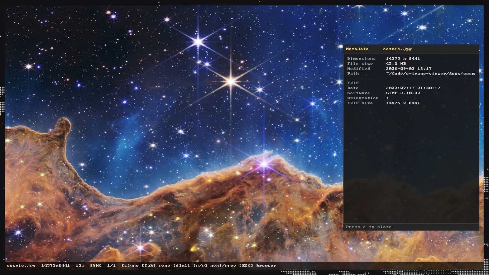

<p align="center">
  <h1 align="center">c-image-viewer</h1>
</p>

<p align="center">
  <strong>Dual-pane image viewer in C11 and SDL2 with synchronized viewport transforms and in-window tree navigation.</strong>
</p>

<p align="center">
  <a href="https://en.wikipedia.org/wiki/C11_(C_standard_revision)"></a>
  <a href="https://www.libsdl.org/"></a>
  <a href="LICENSE"></a>
  
  
</p>

<p align="center">
  
</p>

c-image-viewer is an image viewer written in C11 and SDL2 designed for pixel-level visual inspection and side-by-side image comparison under synchronized affine transforms. It provides hardware-accelerated dual-pane rendering, an in-window directory tree browser with live substring filtering, and embedded EXIF metadata parsing without external image decoding or font library dependencies.

## Quick start

### Install dependencies

Debian / Ubuntu:
```bash
sudo apt update && sudo apt install -y build-essential libsdl2-dev wl-clipboard xclip
```

Arch Linux:
```bash
sudo pacman -S --needed base-devel sdl2 wl-clipboard xclip
```

Fedora:
```bash
sudo dnf install -y gcc make SDL2-devel wl-clipboard xclip
```

### Build and run

```bash
git clone https://github.com/ArdaYILDIZ-DEV/c-image-viewer.git && cd c-image-viewer && make && ./viewer path/to/left.jpg path/to/right.png
```

## Features

- Viewport-synchronized dual inspection: Side-by-side display split at integer midpoint `win_w / 2` with hardware clipping (`SDL_RenderSetClipRect`) preventing visual bleeding across the divider.
- Cursor-anchored affine transformations: Multiplicative scaling (0.05x to 32.0x) with real-time image-space pan compensation that keeps the world point under the mouse cursor stationary.
- In-window directory tree navigation: Non-modal directory tree overlay (`ESC`) with recursive scanning, inline expand/collapse, symlink cycle detection, depth limit enforcement (32 levels), and live substring query filtering.
- Sub-process clipboard isolation: Direct execution of `wl-copy`/`wl-paste` (Wayland) or `xclip`/`xsel` (X11) via `fork`, `execvp`, and anonymous UNIX pipes without invoking `/bin/sh`. Temporary files are created with `0600` permissions via `mkstemps` and immediately unlinked.
- Resilient EXIF and TIFF metadata extraction: Parser guarding against cyclic IFD pointers, integer overflow offsets, zero-denominator rational tags, and non-printable ASCII sequences.
- Batched bitmap text rendering: Monospaced 8x8 font engine coalescing adjacent horizontal glyph pixels into merged spans, reducing SDL draw calls by over 99% (>99.8% on 80-character lines).
- Non-destructive failure recovery: Unreadable, missing, or corrupted images encountered during directory traversal are logged and bypassed without terminating the process or invalidating existing viewport transforms.
- Zero-allocation render pipeline: Layout calculation, status formatting, and span generation execute exclusively on fixed stack buffers with static string caching, eliminating dynamic heap allocations (`malloc`/`free`) on frame rendering hot paths.

## Requirements

- Compiler: GCC >= 11 or Clang >= 13 (C11 standard support required)
- Build tool: GNU Make or POSIX-compliant `make`
- Backend library: SDL2 development libraries (`libsdl2-dev` >= 2.0.18, 2.32 supported)
- Standard C runtime: POSIX.1-2008 standard C library with math runtime (`-lm`)
- Clipboard utilities (optional runtime integration):
  - Wayland: `wl-clipboard` (`wl-copy`, `wl-paste`)
  - X11: `xclip` or `xsel`

Embedded single-header libraries (`external/stb_image.h`, `external/stb_image_write.h`, `external/font8x8.h`) are vendored in the source tree and require no separate package installation.

## Building and installation

The build system follows the Pitchfork layout standard and isolates compilation artifacts inside `build/`:

```bash
# Compile viewer binary to build/viewer and create ./viewer symlink
make

# Execute unit tests under AddressSanitizer and UndefinedBehaviorSanitizer
make test

# Delete build artifacts and symlinks
make clean

# Install binary and desktop file to system prefix (default: /usr/local)
sudo make install

# Install to custom directory prefix (e.g. ~/.local)
make install PREFIX=$HOME/.local

# Remove installed binary and desktop entry from prefix
sudo make uninstall PREFIX=/usr/local
```

### Makefile targets

| Target | Description |
| :--- | :--- |
| `all` (default) | Compiles `build/viewer` with `-O2 -Wall -Wextra -Wpedantic -std=c11` and creates `./viewer` symlink |
| `test` | Compiles and executes `build/test_runner` under ASan and UBSan (`-fsanitize=address,undefined -g`) |
| `clean` | Deletes `build/` directory and symlinks (`viewer`, `test_runner`) |
| `install` | Installs `c-image-viewer` to `$(BINDIR)` and desktop entry to `$(DESKTOPDIR)` |
| `uninstall` | Removes `c-image-viewer` and `c-image-viewer.desktop` from target installation paths |

## Usage

### Command-line syntax

Single-image mode (full-window view):
```bash
./viewer /path/to/image.jpg
```

Dual-pane comparison mode (synchronized split view):
```bash
./viewer /path/to/reference.png /path/to/distorted.png
```

Paths may be relative or absolute. All CLI arguments are validated via `stat()` (`S_ISREG`), read permissions (`R_OK`), and case-insensitive extension matching before graphical initialization.

### Directory navigation

When passing an image file, the viewer scans its parent directory and builds an in-memory file index (`g_file_list`). Navigating forward (`Right` / `n` / `Page Down`) or backward (`Left` / `p` / `Page Up`) steps through valid images in the directory with index wraparound. If an image file fails to decode or is unlinked during execution, navigation automatically skips to the next readable file without terminating the session.

### Drag and drop

Images can be dragged and dropped directly onto the application window:
- Dropping an image onto the left half of the window (`x < win_w / 2`) loads the image into pane 0.
- Dropping an image onto the right half of the window (`x >= win_w / 2`) loads the image into pane 1.
- In single-image mode, dropping onto either side replaces the current image.

## Keybindings and controls

### Viewer keybindings

| Key / Input | Action |
| :--- | :--- |
| `Mouse Wheel` | Multiplicative zoom centered on mouse cursor position (0.05x to 32.0x) |
| `Left Mouse Drag` | Pan active viewport in image-space coordinates |
| `0` or `Ctrl+F` | Fit image(s) to pane dimensions preserving aspect ratio |
| `1` or `Keypad 1` | Reset zoom to 100% (1:1 pixel scale) and center pan offset to (0, 0) |
| `+` / `=` / `Keypad +` | Zoom in by 1.1x centered on viewport center |
| `-` / `Keypad -` | Zoom out by 0.9x centered on viewport center |
| `f` / `F11` | Toggle fullscreen mode (preserves and restores windowed position and geometry) |
| `s` | Toggle viewport synchronization mode (`SYNC` vs `FREE`) |
| `Tab` | Switch active pane between left and right in `FREE` mode |
| `Right` / `n` / `Page Down` | Navigate to next image in directory (skips corrupt files) |
| `Left` / `p` / `Page Up` | Navigate to previous image in directory (skips corrupt files) |
| `i` | Toggle bottom information status bar |
| `e` | Toggle right-hand EXIF metadata and file information panel |
| `h` / `?` | Toggle keyboard shortcuts help overlay |
| `Ctrl+C` | Copy active pane image to system clipboard as PNG (fallback: file path string) |
| `Ctrl+V` | Paste image from system clipboard into active pane |
| `ESC` | Dismiss dialogs; exit fullscreen; toggle directory tree browser |
| `q` | Terminate application and exit |
| `Drag & Drop` | Drop image onto left or right viewport to load into respective pane |

### File browser overlay keybindings

The file browser overlay is toggled by pressing `ESC` while in windowed view.

| Key / Input | Action |
| :--- | :--- |
| `Up` / `k` | Move selection cursor to previous item |
| `Down` / `j` | Move selection cursor to next item |
| `Page Up` / `Page Down` | Scroll visible tree listing by page |
| `Home` / `End` | Jump to first / last matching directory entry |
| `Right` | Expand selected directory inline |
| `Left` | Collapse selected directory; jump to parent if already collapsed |
| `Return` / `Keypad Enter` | Expand/collapse directory or load selected image into active pane |
| `Space` | Toggle directory expansion state |
| `Ctrl+F` | Focus search filter and clear existing query |
| `Backspace` | Delete last search query character; collapses folder when query is empty |
| `Printable characters` (`a-z`, `0-9`, symbols, e.g. `r`, `z`) | Append character to live search filter query (case-insensitive substring match) |
| `ESC` | Clear search query if active; dismiss file browser overlay |
| `Mouse Click` | Select row under mouse cursor |
| `Mouse Double-Click` | Expand/collapse folder or load selected image file |
| `Mouse Wheel` | Scroll directory listing |

## Interface behavior and transform math

### Cursor-centered zoom compensation

When scaling by multiplicative factor $s$ around cursor coordinate $(m_x, m_y)$, the world coordinate under the cursor is maintained stationary. The pan offset is tracked in image space and updated via:

$$pan_{new} = pan_{old} + (cursor - center) \times \left(\frac{1}{zoom_{new}} - \frac{1}{zoom_{old}}\right)$$

where:
- $cursor$ represents $(m_x, m_y)$ in window pixel coordinates.
- $center$ represents pane center coordinates $(c_x, c_y) = (viewport\_x + viewport\_w / 2, viewport\_y + viewport\_h / 2)$ in window pixels.
- $zoom_{old}$ is the current magnification factor prior to scaling, clamped to $[0.05, 32.0]$.
- $zoom_{new} = \text{clamp}(zoom_{old} \times s, 0.05, 32.0)$.

### Image-space panning

Mouse displacement deltas $(\Delta x, \Delta y)$ in screen pixels are translated into image-space pan coordinates:

$$pan_{x,new} = pan_{x,old} + \frac{\Delta x}{zoom}, \quad pan_{y,new} = pan_{y,old} + \frac{\Delta y}{zoom}$$

Dividing screen deltas by the current zoom factor guarantees that feature displacement under the mouse pointer tracks at a constant 1:1 screen-to-feature velocity regardless of zoom magnification.

### Dual-pane synchronization and viewport isolation

In dual-pane mode (`g_count == 2`):
- Viewport division: The window is partitioned at integer coordinate $mid = \lfloor win\_w / 2 \rfloor$. Pane 0 occupies $\{x: 0, y: 0, w: mid, h: win\_h\}$; pane 1 occupies $\{x: mid, y: 0, w: win\_w - mid, h: win\_h\}$. A 1-pixel vertical divider line is rendered at $x = mid$ using color `RGB(60, 60, 60)`.
- Hardware clipping: Each pane render is strictly bounded via `SDL_RenderSetClipRect()`, preventing pixel bleeding across the central divider.
- Viewport culling: Destination bounding rectangles are calculated prior to rendering; if the projected bounds do not intersect the pane clipping rectangle, `SDL_RenderCopyF` draw calls are bypassed.
- SYNC mode: Panes share identical zoom (`g_zoom`) and pan (`g_pan_x`, `g_pan_y`) coordinates. Zooming or panning either viewport updates both views identically.
- FREE mode: Each pane stores independent coordinates (`g_free_zoom[i]`, `g_free_pan_x[i]`, `g_free_pan_y[i]`). Transformations apply strictly to the active pane (`g_active`), toggled with `Tab`.
- Active pane indicator: In FREE mode, the active pane is highlighted with a 1-pixel inset blue border (`RGB(100, 160, 255)`). The status bar displays `[L*]` or `[R*]` to designate the active viewport, and the window title displays `[L]` or `[R]`. In SYNC mode, these indicators are omitted.

### Responsive status bar layout

The status bar dynamically calculates horizontal space and formats metadata and shortcut hints without overlapping:
- Usable character budget: Computed via:
  $$usable\_chars = \frac{win\_w - 12}{8}$$
  derived from $(win\_w - 2 \times VIEWER\_INFO\_MARGIN\_X) / VIEWER\_INFO\_FONT\_W$, where margin is 6 px and bitmap glyph width is 8 px.
- Monotonic four-tier degradation: Evaluates four shortcut hint tiers from `FULL` down to `NONE`:
  - `FULL`: Displays complete keybindings (`"[s]ync [Tab] pane [f]ull [n/p] next/prev [e] exif [ESC] browser"` in single-pane mode; `"[s]ync [Tab] pane [f]ull [e] exif [ESC] browser"` in dual-pane mode).
  - `COMPACT`: Displays common controls (`"[s]ync [f]ull [n/p] [e]xif [ESC]"` in single-pane mode; `"[s]ync [Tab] pane [e] exif"` in dual-pane mode).
  - `MINIMAL`: Displays overlay toggles (`"[e] exif [ESC]"` in single-pane mode; `"[e] exif"` in dual-pane mode).
  - `NONE`: Suppresses shortcut hints (`""`).
- Token atomicity: Shortcut hints degrade strictly as atomic strings. A tier is selected only if the remaining character budget after fixed metadata and hint cost satisfies the target filename budget (`VIEWER_INFO_NAME_TARGET_SINGLE` = 32 characters in single-pane mode; combined $2 \times VIEWER\_INFO\_NAME\_TARGET\_DUAL = 36$ characters in dual-pane mode).

### Dual-pane surplus character transfer

When displaying dual-pane status lines, available filename character budget is distributed between pane 0 and pane 1 via `viewer_distribute_dual_budget`:
- Equal baseline split: The total budget is partitioned as $b_0 = \lfloor total\_budget / 2 \rfloor$ and $b_1 = total\_budget - b_0$.
- Bilateral surplus donation: If pane 0 requires fewer characters than $b_0$ ($len_0 < b_0$) and pane 1 requires more ($len_1 \ge b_1$), the unused surplus $(b_0 - len_0)$ is transferred to $b_1$. Conversely, if pane 1 requires fewer characters than $b_1$ ($len_1 < b_1$) and pane 0 requires more ($len_0 \ge b_0$), the unused surplus $(b_1 - len_1)$ is transferred to $b_0$.
- Conservation invariant: The total allocated characters strictly match the available budget:
  $$out_0 + out_1 = total\_budget \quad (\text{for } total\_budget \ge 0)$$

### String truncation mechanics

- Extension-preserving filename truncation (`viewer_truncate_filename`): When a filename exceeds its allocated character budget, it formats as `prefix...ext`. The file extension is preserved, and the stem is truncated with an ellipsis before the extension. If the budget is $\le 3$, it outputs `...`. If the budget is $\le 0$, it produces an empty NUL-terminated string.
- Middle directory path truncation (`viewer_truncate_path`): Formats filesystem paths as `prefix.../basename`. Preserves the leading root directory and the target filename while collapsing intermediate path components into `.../`. If the filename itself exceeds the budget, it falls back to extension-preserving filename truncation.

### Metadata overlay layout engine

The EXIF and metadata overlay panel geometry is calculated via `viewer_calc_metadata_layout`:
- Minimum dimensions invariant: Requires a minimum width of 160 px (`VIEWER_METADATA_MIN_PW`) and minimum height of 80 px (`VIEWER_METADATA_MIN_PH`). Standard panel width is 380 px (`VIEWER_METADATA_STANDARD_PW`), clamped to $win\_w - 40$. If window dimensions are smaller than minimum bounds, the panel is hidden (`visible = false`).
- Adaptive column widths: When panel width $\ge 300$ px, the label column width is fixed at 100 px. In narrow panels ($< 300$ px), the label column dynamically scales to 38% of inner width (floored at 48 px), allocating the remaining width to the value column with an 8 px gap.
- Footer non-overlap invariant: Panel height is calculated to encompass all rendered rows:
  $$ph = 36 + (5 \times line\_h) + 26 + (exif\_rows \times line\_h) + 12 + 20$$
  where $line\_h = 14$ px. The footer baseline is locked to $py + ph - 20$, ensuring the footer text never collides with or overlaps image metadata rows.
- Channel format decoding (`viewer_format_color_depth`): Decodes source channel counts into descriptive topology strings:
  - 1 channel: `8-bit Grayscale`
  - 2 channels: `16-bit Gray+Alpha`
  - 3 channels: `24-bit RGB`
  - 4 channels: `32-bit RGBA`
  - $N > 4$ channels: `%d channels`
  - $\le 0$ channels: `Unknown`
- Exact byte sizing (`viewer_format_file_size`): File sizes from `stat()` `st_size` are formatted with exact byte counts appended in parentheses for values $\ge 1024$ bytes:
  - $< 1024$ B: `%lld B`
  - $< 1$ MB: `%.1f KB (%lld B)`
  - $< 1$ GB: `%.1f MB (%lld B)`
  - $\ge 1$ GB: `%.2f GB (%lld B)`

### Performance profile and zero-allocation hot paths

- Zero heap allocations on render hot paths: Hot-path functions (`viewer_render`, `viewer_render_info_bar`, `viewer_render_metadata`, `viewer_calc_status_layout_*`, `viewer_format_status_*`) perform zero dynamic memory allocations (`malloc`/`calloc`/`realloc`/`free`). All intermediate calculations operate on fixed stack buffers.
- Static string caching: File metadata strings (`s_cached_size_str`, `s_cached_mtime_str`, `s_cached_path_disp`) and EXIF structs (`s_cached_exif`) are cached against `s_cached_md_path`. Rendering static frames bypasses filesystem `stat()` syscalls and string formatting entirely.
- Sub-microsecond formatting: Branch-predicted digit counting (`viewer_int_digits`) and precomputed hint costs eliminate runtime format scanning. Under optimized builds (`-O2`), status bar layout and formatting execute in sub-microsecond time (<1 microsecond per call; 100,000 single and dual iterations complete in 446 ms under debug ASan/UBSan, <50 ms in release). Truncation routines complete in ~138 ns.

## Supported formats

Image decoding is handled by vendored `stb_image.h`:

| Format | Extensions | Channels | Color topology | Decoding engine |
| :--- | :--- | :--- | :--- | :--- |
| JPEG / JPG | `.jpg`, `.jpeg` | 1, 3 | 8-bit Grayscale, 24-bit RGB | `stb_image.h` (baseline, progressive, EXIF APP1 tags/orientation) |
| PNG | `.png` | 1, 2, 3, 4 | 8-bit Gray, 16-bit Gray+Alpha, 24-bit RGB, 32-bit RGBA | `stb_image.h` (1-bit through 16-bit channel depth) |
| WebP | `.webp` | 3, 4 | 24-bit RGB, 32-bit RGBA | `stb_image.h` (VP8 lossy, VP8L lossless) |
| BMP | `.bmp` | 1, 3, 4 | Indexed, 24-bit RGB, 32-bit RGBA | `stb_image.h` (uncompressed and RLE-encoded) |
| Netpbm | `.ppm`, `.pgm`, `.pbm` | 1, 3 | 1-bit Mono (PBM), 8-bit Gray (PGM), 24-bit RGB (PPM) | `stb_image.h` (binary P4/P5/P6 and ASCII P1/P2/P3) |
| TIFF | `.tiff`, `.tif` | 1, 3, 4 | 8-bit Gray, 24-bit RGB, 32-bit RGBA | `stb_image.h` (baseline TIFF, uncompressed, PackBits) |
| GIF | `.gif` | 3, 4 | 24-bit RGB, 32-bit RGBA | `stb_image.h` (static frames and first frame of animated GIF) |
| Radiance HDR | `.hdr` | 3 | 32-bit/channel RGBE float | `stb_image.h` (high dynamic range) |
| Adobe Photoshop | `.psd` | 3, 4 | 24-bit RGB, 32-bit RGBA | `stb_image.h` (composited image view) |
| Truevision TGA | `.tga` | 1, 3, 4 | 8-bit Gray, 24-bit RGB, 32-bit RGBA | `stb_image.h` (uncompressed and RLE) |

## Project structure

The repository follows the Pitchfork layout standard:

```
.
├── assets/
│   └── c-image-viewer.desktop       # XDG desktop entry specification
├── external/
│   ├── font8x8.h                    # 8x8 monochrome bitmap font (public domain)
│   ├── stb_image.h                  # Image decoding library (public domain)
│   └── stb_image_write.h            # PNG encoding library for clipboard export
├── include/
│   ├── browser.h                    # In-window directory tree browser interface
│   ├── clipboard.h                  # Process-isolated clipboard operations interface
│   ├── exif.h                       # JPEG APP1 and TIFF metadata parser interface
│   ├── text.h                       # Batched bitmap font rendering interface
│   └── viewer.h                     # Viewport state, transform math, and rendering interface
├── src/
│   ├── browser.c                    # Directory tree traversal, expand/collapse, substring filter
│   ├── clipboard.c                  # Safe fork/exec clipboard dispatch with anonymous UNIX pipes
│   ├── exif.c                       # TIFF IFD parser, tag extraction, circular pointer guards
│   ├── main.c                       # SDL initialization, event dispatch, window management
│   ├── text.c                       # Glyph span coalescing and batched rectangle submission
│   └── viewer.c                     # Texture creation, affine transforms, dual-pane layout engine
├── tests/
│   ├── test_browser.c               # Browser tree, symlink safety, and filter stress tests
│   ├── test_clipboard.c             # Sub-process execution and argument sanitization tests
│   ├── test_common.h                # Unit testing macros and assertion harness
│   ├── test_exif.c                  # Malformed headers, circular IFD loops, tag parser tests
│   ├── test_main.c                  # Unified test suite runner entry point
│   ├── test_text.c                  # Span equivalence and draw call reduction benchmarks
│   └── test_viewer.c                # Viewport culling, layout invariants, math, and benchmarks
├── Makefile                         # Out-of-source compilation, testing, and install targets
└── README.md                        # Technical documentation
```

## Development and testing

### Automated test suite

The test suite executes 56 unit tests compiled under AddressSanitizer and UndefinedBehaviorSanitizer:

```bash
make test
```

Execution runs under `SDL_VIDEODRIVER=dummy` and tests:
- EXIF parsing: Synthetic Little-Endian and Big-Endian headers, circular IFD reference guards, corrupt APP1 markers, zero-denominator rational values, non-printable ASCII sanitization, and out-of-bounds offset limits.
- Batched text engine: Pixel-exact span equivalence, clip bounds rejection, and draw call reduction (>99.8% draw call reduction on 80-character strings).
- Clipboard security: Direct argument vector execution, absence of shell metacharacter expansion, anonymous UNIX pipe isolation, and temporary file lifecycle (`0600` permissions with atomic unlinking).
- Viewport and layout invariants: Degenerate window sizes (0x0, negative), dual-pane boundary division, bilateral character surplus redistribution, extension-preserving filename truncation, path middle truncation, metadata panel dimensions, and off-screen viewport culling.
- Directory browser: Recursive scanning, expand/collapse state tracking, 32-level directory depth limit, circular symlink protection, empty/unreadable folder handling, and live filter substring matching.

### Headless smoke test

To verify startup, window creation, texture generation, and clean shutdown in environments without a physical display:

```bash
SDL_VIDEODRIVER=dummy timeout 2 ./build/viewer /path/to/test.png
```

The process executes normally under the dummy video driver and exits with code `124` when `timeout` terminates the event loop.

### Performance benchmarks

The automated test runner includes micro-benchmarks measuring rendering and string processing throughput:
- Text batching benchmark: 1,999 raw pixels merged into 787 horizontal spans (60.6% rectangle reduction); 1,422 raw SDL draw calls reduced to 3 batched calls (>99.8% call reduction).
- Status bar layout benchmark: 100,000 iterations (50k single + 50k dual) complete in 446 ms under debug ASan/UBSan (<50 ms in release `-O2`).
- Truncation benchmark: 100,000 iterations (50k filename + 50k path) complete in 42 ms under debug ASan/UBSan (~138 ns per truncation in release `-O2`).
- Browser filtering benchmark: Filtering 300 entries, performing 40 virtual renders, and updating navigation completes in 2 ms.

## Troubleshooting

### 'xclip: command not found' or 'wl-copy: command not found'

**Diagnostic command:**
```bash
which wl-copy xclip xsel 2>&1
```

**Cause:** Neither Wayland (`wl-clipboard`) nor X11 (`xclip`/`xsel`) clipboard binaries are installed or present in `$PATH`. When copying an image (`Ctrl+C`), the viewer falls back to copying the plain text filesystem path.

**Resolution:**
- On Wayland: Install `wl-clipboard` (`sudo apt install wl-clipboard`, `sudo pacman -S wl-clipboard`, or `sudo dnf install wl-clipboard`).
- On X11: Install `xclip` (`sudo apt install xclip`, `sudo pacman -S xclip`, or `sudo dnf install xclip`) or `xsel`.

### 'SDL_Init Error: No available video device'

**Diagnostic command:**
```bash
echo "DISPLAY=$DISPLAY WAYLAND_DISPLAY=$WAYLAND_DISPLAY"
```

**Cause:** SDL2 cannot establish a connection to an active X11 or Wayland display server, typically occurring in headless server environments, automated continuous integration runners, or SSH sessions without X11 forwarding.

**Resolution:**
- Interactive sessions: Verify that the window manager or Wayland compositor is active and that `$DISPLAY` or `$WAYLAND_DISPLAY` is exported in the shell environment.
- SSH sessions: Connect with X11 forwarding enabled (`ssh -X` or `ssh -Y`).
- Headless or CI testing: Export `SDL_VIDEODRIVER=dummy` before executing binaries to bypass physical display requirements.

### 'Failed to open image'

**Diagnostic command:**
```bash
file --mime-type /path/to/target_file && ls -l /path/to/target_file
```

**Cause:** The target file path does not exist, does not reference a regular file (`S_ISREG`), lacks read permissions (`R_OK`), has an unrecognized file extension, or contains corrupted header bytes that fail `stb_image` decoding.

**Resolution:**
- Confirm file existence and readable permissions (`chmod +r /path/to/target_file`).
- Verify the file extension matches one of the supported formats (`.jpg`, `.jpeg`, `.png`, `.webp`, `.bmp`, `.ppm`, `.pgm`, `.pbm`, `.tiff`, `.tif`, `.gif`, `.hdr`, `.psd`, `.tga`).
- Validate image file integrity using `file` or ImageMagick `identify /path/to/target_file`.

## License

This project is licensed under the MIT License. See [LICENSE](LICENSE) for the full text.
